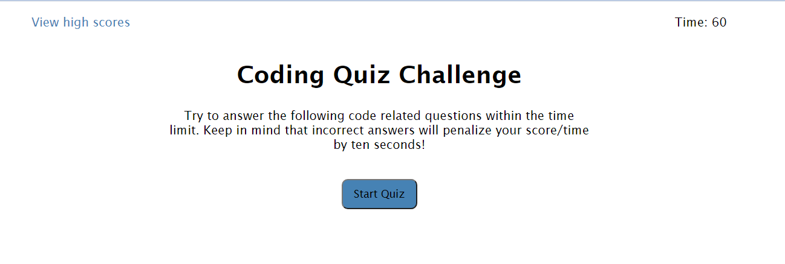
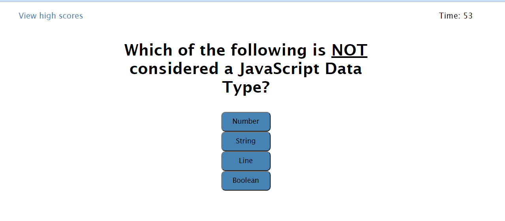
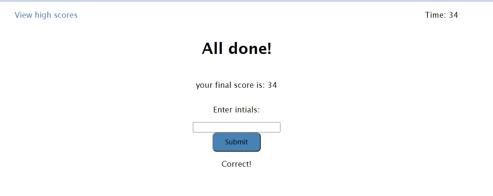
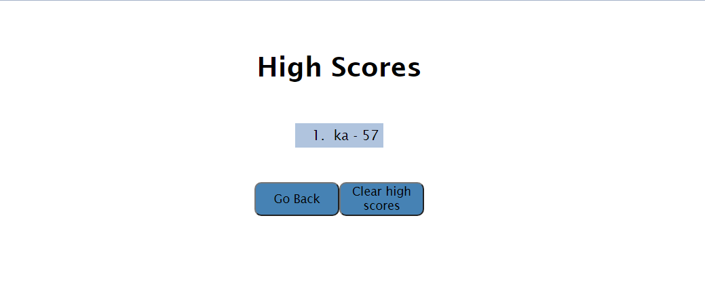

# timed-coding-quiz

**Description**

This is a timed coding quiz. The user will be presented with a total of 4 questions to complete in 6o seconds. When an incorrect answer is chosen 10 seconds will be deducted from the timer. When all questions are answered the user will see their final score and be able to enter their initials and submit their high score. If the questions are not completed in the 60 seconds you will be taken to the all done screen to enter your initials, but your score will be 0. 

**Website Layout**

This is the main screen, the starting point

This is the first question, at this point the timer has started

At the end of the quiz, the final score is presented, the user has the chance to enter their initials and submit them to the highscores board

This is the high scores board  

**Website Link**

https://kimberlyamaya.github.io/timed-coding-quiz/

**Editors**

Kimberly Amaya
